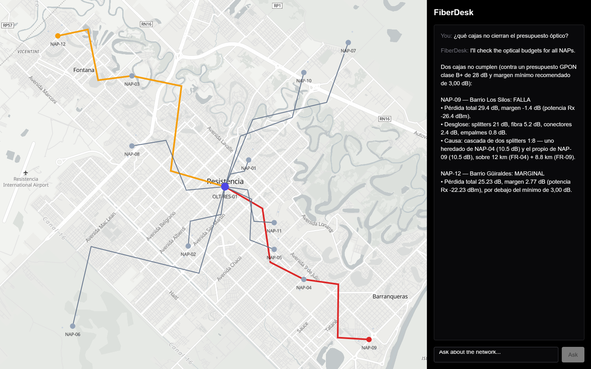

# FiberDesk

An AI copilot over an FTTH network: an interactive map plus technical documentation.



*Asked "¿qué cajas no cierran el presupuesto óptico?", the assistant surveys all twelve NAPs, then
details only the two that need it, while the map colours them by classification — NAP-09 failing in
red, NAP-12 marginal in amber — and traces each one's path back to the OLT. Every figure in that
answer came from the budget engine, not from the model. The answer shown is the one from the
recorded live run in `openspec/changes/archive/2026-09-22-add-map-copilot/verification.md`.*

You see the fiber infrastructure drawn on a map — the OLT, the splitter enclosures (NAPs), the
fiber runs, the subscribers — and ask questions in plain language. The assistant answers *and*
highlights the answer on the map. It also computes the optical power budget of any link, and
answers from loaded technical documentation while citing its source.

**The rule that shapes every design decision:** the model reasons and orchestrates, the code
calculates. The LLM decides *what* to compute and over *which* entities, then explains the result.
The arithmetic is done by deterministic TypeScript that always returns the same answer. A numeric
answer produced by the model instead of a tool is a bug, not a shortcut.

## Status

**Phase 0 — foundations — done.** The scaffold, the spec workflow and the network dataset are in
place.

**Phase 1 — the conversational core — done.** The optical budget engine and the assistant that
calls it are both in place. Phase 1 is demonstrable end to end: ask a question, watch the answer
stream in.

**Phase 2 — documentation search — done.** The assistant can search a corpus of technical
documentation and cite what it finds, and can compare a documented figure against the system's
own optical constants. No vector database, no second service — see *The documentation corpus*,
below, for why.

**Phase 3 — the map copilot — done.** The plain chat page is now a full-screen map with the chat
as a side panel. Every NAP the assistant highlights is coloured and reframed on the map, and any
NAP can be clicked for its optical budget breakdown — see *The map*, below.

## Getting started

```bash
npm install
cp .env.example .env.local   # then set ANTHROPIC_API_KEY
npm run dev
```

The app runs at [http://localhost:3000](http://localhost:3000): the map and the network draw
immediately, key or not. Without a key, the chat panel still loads and reports the missing
variable as soon as you ask a question — see *Failing loudly*, below.

```bash
npm test          # run the suite once
npm run test:watch
```

Every test runs against recorded fixtures and the real seed. **None of them call the Anthropic
API** — see *The assistant*, below.

## The network dataset

`seed/network.json` holds the network the whole product reasons about: one OLT in Resistencia
(Chaco, Argentina), 12 NAPs across the city, the fiber runs connecting them, and the subscribers
they serve.

**Everything in it is invented.** The coordinates are real places and the physics is real, but no
element comes from a real operator, a real customer or a production system, and none ever will.

### The edge cases are deliberate

A network where every link passes cannot demonstrate anything — the product's core question is
*which links fail their optical budget*, and that question needs an answer. So the dataset is built
to contain failures:

| NAP | Total loss | Margin (B+ budget, 28 dB) | Why |
|---|---|---|---|
| **NAP-09** | 29.40 dB | **−1.40 dB** — fails | Two 1:8 splitters cascaded: 21 dB of splitter loss alone |
| **NAP-12** | 25.23 dB | **2.77 dB** — marginal | A 1:2 feeding a 1:16, plus 19.8 km of fiber; below the 3 dB minimum |
| **NAP-06** | 24.56 dB | 3.44 dB — passes | No cascade, but a 1:32 at the end of a 20 km run: just above the threshold |

The remaining nine NAPs pass with comfortable margin. Splitter cascades are the most common reason
a real link ends up marginal, so two of the three cases are cascades.

### Expected outcomes are committed as an oracle

`seed/expected-budgets.json` records, per NAP, the accumulated inputs (kilometres, connectors,
splices, splitter chain) and the loss figures they produce. It was derived by hand **before** any
calculator existed, so the Phase 1 optical budget engine has something independent to be checked
against. If the two disagree, one of them is wrong, and the disagreement is the signal.

⚠️ The loss values behind those figures (0.25 dB/km, 0.40 dB per connector, 0.08 dB per splice, and
the splitter table) are industry-typical and **pending validation** against real specifications.
Do not treat them as established fact.

### Loading it

`src/lib/network/load.ts` reads and validates the seed on the server. Validation is all-or-nothing:
you get a network satisfying every structural rule — single root, no cascade cycles, every
reference resolving, supported splitter ratios, coordinates inside the modelled city — or an error
naming what broke. Nothing is silently dropped, defaulted or repaired.

## The optical budget engine

`src/lib/optical/` computes how much a link from the OLT to a NAP attenuates, how much headroom
that leaves against the OLT's declared GPON class, and what that headroom means.

**This arithmetic never runs in the model.** `calculateBudget(network, napId)` is plain,
deterministic TypeScript: same inputs, same output, every time. In the next change, the model's
job is to decide which NAPs to ask about and to explain the result in words — never to compute a
number itself.

```ts
const result = calculateBudget(network, "NAP-12");
// { total_loss_db: 25.23, margin_db: 2.77, status: "marginal",
//   rx_power_dbm: -22.23, by_source: { fiber_db: 4.95, splitters_db: 17, ... },
//   hops: [ { run_id: "FR-03", splitter: { at: "NAP-03", ratio: "1:2", ... } },
//           { run_id: "FR-12", splitter: { at: "NAP-12", ratio: "1:16", ... } } ] }
```

The result carries a per-hop breakdown, not just a total, because *explaining* a marginal link
means naming which cascade is responsible — NAP-12's 17 dB of splitter loss splits into 13.50 dB
of its own 1:16 and 3.50 dB inherited from NAP-03 upstream. Without that attribution, an
explanation can only be guessed at, which is exactly what this project is built to avoid.

`calculateAllBudgets(network)` evaluates every NAP in one pass. It is a plain `map` over the
single-NAP function — one implementation of the arithmetic, never two that could drift apart.

Every optical constant — fiber attenuation, connector and splice loss, splitter insertion loss,
the per-class GPON budget — lives in `src/lib/optical/constants.ts`, each commented with its unit
and its standing as industry-typical and **pending validation**. The 3 dB minimum margin used to
classify a link lives there too, but separately: it is an operational recommendation, not a
physical constant, and every call can override it.

**The dataset's fixture is bound to the tests.** `seed/expected-budgets.json` was derived by hand
before this engine existed; `src/lib/optical/fixture.test.ts` asserts the engine reproduces it
exactly, for all 12 NAPs. Editing a constant now fails the suite — on purpose, so that change has
to go through a spec rather than land as a quiet data edit.

## The assistant

`src/lib/assistant/` and `src/app/api/chat/route.ts` are the copilot: a route handler that streams
an answer while orchestrating the optical budget engine and the documentation corpus through tool
calls. **The model never computes a number and never states a documented figure it did not just
retrieve.** Every figure it states comes from one of four tools, named for the shape of their
answer rather than the operation:

- **`summarize_optical_budgets`** — one thin row per NAP (id, name, total loss, margin, status).
  No required arguments, so the model does not need to know any NAP identifier in advance. Call
  this first.
- **`detail_optical_budget`** — the full per-hop breakdown for one NAP, the only source that can
  attribute a loss to a specific fiber run or splitter. Call this after, only for the NAPs worth
  explaining.
- **`search_documentation`** — the passages in the technical corpus that match a query, returned
  as citable `search_result` blocks. See *The documentation corpus*, below.
- **`get_optical_constants`** — what the system itself computes with, so a documented figure can
  be checked against it rather than assumed to agree.

Survey first, detail second: twelve full breakdowns cost roughly 1,650 tokens against roughly 630
for a survey plus detail on the two links that actually fail — and firing all twelve at once would
require the model to already know every identifier, which the survey exists to avoid.

**The map highlight is projected in code, never emitted by the model.** Every field in it —
identifier, status, margin — already exists in a tool result. Asking the model to repeat it back
would be asking it to copy numbers, and copying is exactly where a model writes 2.7 for 2.77.

There is no server-side conversation store. Each streamed turn ends with the exact updated message
array the server sent to the model — tool calls and results intact — and the browser tab holds
that array and resends it verbatim on the next question. Close the tab and the conversation is
gone; that is by design for now.

### Failing loudly

Ask a question without `ANTHROPIC_API_KEY` set and the chat page shows the error in place, rather
than hanging or crashing — the same "fail with a named error, never a silent gap" principle the
network loader follows.

### Tests never call the API

Every test in `src/lib/assistant/` runs against recorded fixtures — literal `Message` objects
standing in for what the API would return — with the tools executing for real against the seed.
The loop, the dispatcher, the highlight projection and the SSE encoding are all exercised this way;
the model itself is not. Some behaviours can't be tested this way at all — that the assistant
surveys before it drills into detail, that it says "I don't know" instead of inventing an answer,
that it cites what it retrieves, and that it surfaces rather than silently resolves a disagreement
between a document and the constants — and are verified by hand instead. This project has no
evals; see the `design.md` of the `add-conversational-layer` and `add-documentation-search`
changes (under `openspec/changes/`, or `openspec/changes/archive/` once archived) for what that
costs.

## The map

`src/components/NetworkMap.tsx` draws the whole synthetic network — the OLT, all 12 NAPs, every
fiber run along its stored geometry, and all 28 subscribers — on a [MapLibre
GL](https://maplibre.org/) map, the moment the page opens. Base tiles come from
[OpenFreeMap](https://openfreemap.org/), which needs no API key and no account: `src/lib/map/config.ts`
points at its hosted `positron` style. If that style can't be reached, the map falls back to a
plain background and keeps the network overlay interactive — the overlay is the product, the tiles
are decoration.

MapLibre 6 loads its web worker from a URL relative to its own bundle, and Turbopack does not emit
that file. `npm run dev` and `npm run build` therefore run `scripts/copy-maplibre-worker.mjs`
first, which copies the worker from `node_modules` into `public/maplibre/` (git-ignored), and the
map points MapLibre at it with `setWorkerUrl`.

**Every figure the map shows still comes from the server, unchanged.** `src/app/page.tsx` is a
server component: it loads the network and computes every NAP's budget once, with the same
`calculateBudget` engine described above, and hands both down as props. When a turn ends, the
assistant's `HighlightPayload` — the same one the route handler has always emitted — is resolved
against that data by `src/lib/map/highlight.ts` (`resolveHighlight`), a pure, unit-tested function
that decides which NAPs to colour, which fiber runs lie on their path back to the OLT, and where
to fit the view. The map component only calls MapLibre's `setFeatureState` with that result; it
never recolours, reclassifies or recomputes anything itself.

**Clicking any NAP** — highlighted or not, before or after asking a question — opens its full
optical budget breakdown: `src/lib/map/breakdown.ts` (`formatBreakdown`) formats a `BudgetResult`
into display rows, each numeric string exactly `value.toFixed(2)` of the figure the engine
produced. The panel displays; it does not add, subtract or round.

On a desktop-width screen the map fills the viewport with the chat as a ~400px right-hand column;
on a narrow screen they stack, map above chat, with no horizontal scrolling.

## The documentation corpus

`corpus/*.md` holds the technical documentation the assistant can search and cite. Each file is
plain Markdown: one `#` title, one or more `##` sections, each with at least one paragraph.

**Everything in it is invented**, the same as the network dataset — these read like GPON
deployment and specification notes, but no document is copied from a real vendor, a real operator,
or a published standard. A citation the assistant produces points at one of these invented
documents; the mechanism is real, the source is not.

### Why there is no vector database

The original plan for this phase was FastAPI, PostgreSQL and pgvector. It didn't survive three
facts, checked against the installed SDK rather than recalled: Anthropic has no embeddings
endpoint, so a vector database would mean a second AI provider for five documents; citations are
native (`citations: { enabled: true }`); and the `search_result` content block exists,
purpose-built for a tool to return citable passages.

What replaced it is `src/lib/corpus/`: a loader, a BM25 ranker, and a mapping from a ranked section
to a citable result — all TypeScript, all in-process, all covered by unit tests because the
ranking is deterministic. The model still closes the semantic gap BM25 can't: it composes the
search query, so a question in Spanish about "atenuación por humedad" becomes an English query
about moisture and water absorption before it ever reaches the ranker.

### The gap and the contradiction are deliberate

Same reasoning as the network dataset's edge cases: a corpus where everything is present and
everything agrees can't demonstrate anything.

- **A gap.** No document states an ONT receiver sensitivity figure — deliberately, because the
  optical constants don't model it either. Ask about it and the assistant should say so, the same
  answer it already gives when asked about the constant directly.
- **A contradiction.** `gpon-link-budget.md` states fiber attenuation at 1490 nm as 0.22 dB/km;
  `src/lib/optical/constants.ts` computes with 0.25. Ask what figure to use and the assistant
  should report both, name where each came from, and say they disagree — not pick one quietly.

### The scale this is built for

A handful of short documents, indexed in memory at process start with no persistence. This is a
deliberate choice, not a placeholder for something bigger: see `design.md` for when embeddings
would actually earn their cost. Replacing `corpus/` with your own Markdown files works as long as
you stay roughly in this range — the loader will happily index more, but relevance and cost both
degrade well before a corpus of hundreds of documents, and that scale needs a different design.

## How changes are made here

Every non-trivial change starts as an OpenSpec proposal, before any code is written. `openspec/`
holds that process: `specs/` is what the system does today, `changes/` is what is being proposed.

```bash
npx openspec list   # active changes
npx openspec view   # interactive dashboard
```

## Stack

Next.js (App Router) · TypeScript · Tailwind CSS · Vitest · the Anthropic SDK · MapLibre GL. No
database, no second service, no second language — documentation search is BM25 in the same
process as everything else, and the map's base tiles are the one thing that comes from outside
the app, from OpenFreeMap, with no key required.
